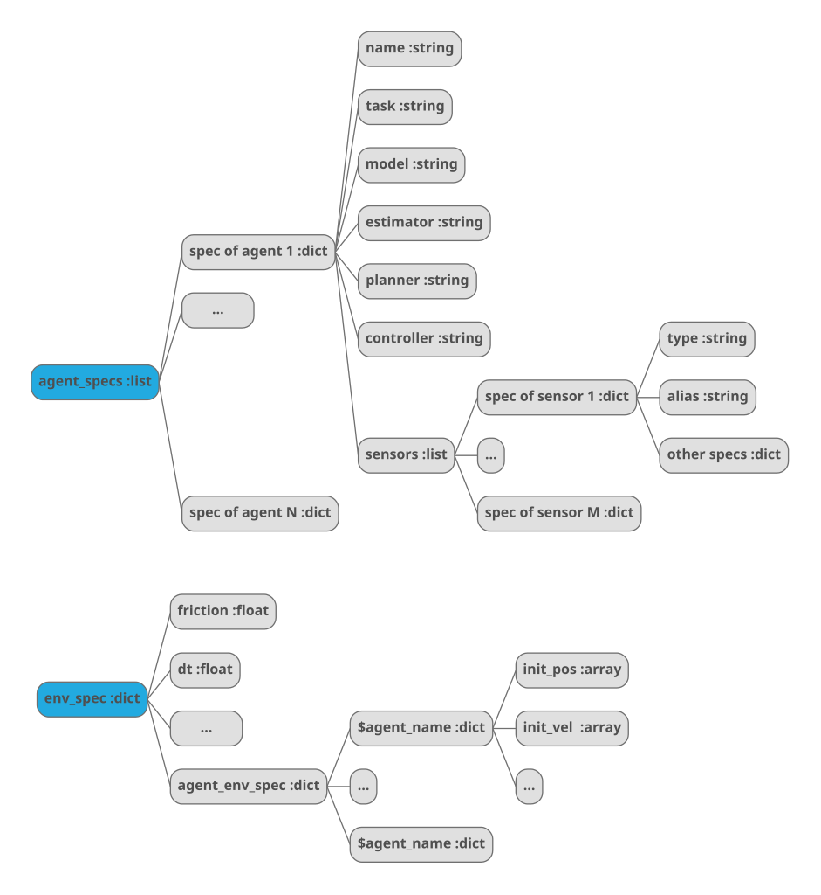

# Benchmark
Benchmark for planner, controller, model, estimator, etc.

## Requirements

The python version is 3.8. But the code should be compatible with all 3.x version.

We specified the dependencies in `environment.yml`. You can reproduce the conda environment by

```bash
conda env create -f environment.yml
```

## Usage

Change the specs and run `python benchmark.py`.

The specs strutue is shown below. 




## Developer Guide

> The point of having style guidelines is to have a common vocabulary of coding so people can concentrate on what you’re saying rather than on how you’re saying it. If code you add to a file looks drastically different from the existing code, it throws readers out of their rhythm when they go to read it. Avoid this.

We should follow the [google python style guide](http://google.github.io/styleguide/pyguide.html). You don't have to go through everything. But please refer to this book for the part you need.

Some chapters I think everyone should read
### Python Language Rules
* [2.1 Lint](http://google.github.io/styleguide/pyguide.html#21-lint)
* [2.2 Imports](http://google.github.io/styleguide/pyguide.html#22-imports)
* [2.3 Packages](http://google.github.io/styleguide/pyguide.html#23-packages)
* [2.12 Default Argument Values](http://google.github.io/styleguide/pyguide.html#212-default-argument-values)
* [2.13 Properties](http://google.github.io/styleguide/pyguide.html#213-properties)
* [2.14 True/False Evaluations](http://google.github.io/styleguide/pyguide.html#214-truefalse-evaluations)
* [2.17 Function and Method Decorators](http://google.github.io/styleguide/pyguide.html#217-function-and-method-decorators)
* [2.21 Type Annotated Code](http://google.github.io/styleguide/pyguide.html#221-type-annotated-code)
### Python Style Rules
* [3.3 Parentheses](http://google.github.io/styleguide/pyguide.html#33-parentheses)
* [3.4 Indentation](http://google.github.io/styleguide/pyguide.html#34-indentation)
* [3.8 Comments and Docstrings](http://google.github.io/styleguide/pyguide.html#38-comments-and-docstrings)
* [3.9 Classes](http://google.github.io/styleguide/pyguide.html#39-classes)
* [3.12 TODO Comments](http://google.github.io/styleguide/pyguide.html#312-todo-comments)
* [3.13 Imports formatting](http://google.github.io/styleguide/pyguide.html#313-imports-formatting)
* [3.16 Naming](http://google.github.io/styleguide/pyguide.html#313-imports-formatting)


The most widely violated convention, naming style:

<table rules="all" border="1" summary="Guidelines from Guido's Recommendations"
       cellspacing="2" cellpadding="2">

  <tr>
    <th>Type</th>
    <th>Public</th>
    <th>Internal</th>
  </tr>

  <tr>
    <td>Packages</td>
    <td><code>lower_with_under</code></td>
    <td></td>
  </tr>

  <tr>
    <td>Modules</td>
    <td><code>lower_with_under</code></td>
    <td><code>_lower_with_under</code></td>
  </tr>

  <tr>
    <td>Classes</td>
    <td><code>CapWords</code></td>
    <td><code>_CapWords</code></td>
  </tr>

  <tr>
    <td>Exceptions</td>
    <td><code>CapWords</code></td>
    <td></td>
  </tr>

  <tr>
    <td>Functions</td>
    <td><code>lower_with_under()</code></td>
    <td><code>_lower_with_under()</code></td>
  </tr>

  <tr>
    <td>Global/Class Constants</td>
    <td><code>CAPS_WITH_UNDER</code></td>
    <td><code>_CAPS_WITH_UNDER</code></td>
  </tr>

  <tr>
    <td>Global/Class Variables</td>
    <td><code>lower_with_under</code></td>
    <td><code>_lower_with_under</code></td>
  </tr>

  <tr>
    <td>Instance Variables</td>
    <td><code>lower_with_under</code></td>
    <td><code>_lower_with_under</code> (protected)</td>
  </tr>

  <tr>
    <td>Method Names</td>
    <td><code>lower_with_under()</code></td>
    <td><code>_lower_with_under()</code> (protected)</td>
  </tr>

  <tr>
    <td>Function/Method Parameters</td>
    <td><code>lower_with_under</code></td>
    <td></td>
  </tr>

  <tr>
    <td>Local Variables</td>
    <td><code>lower_with_under</code></td>
    <td></td>
  </tr>

</table>
